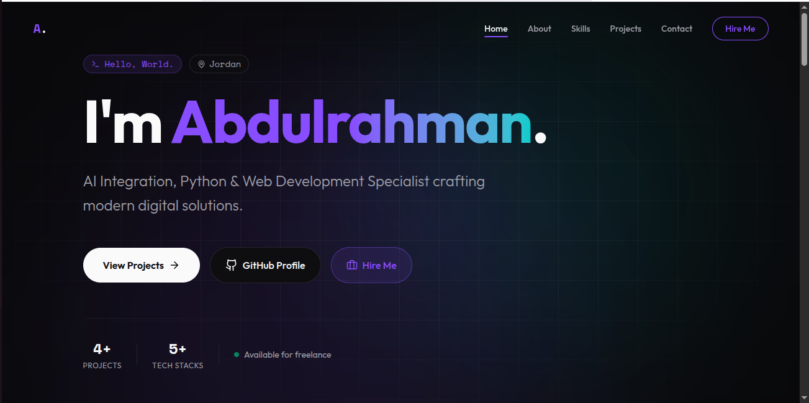
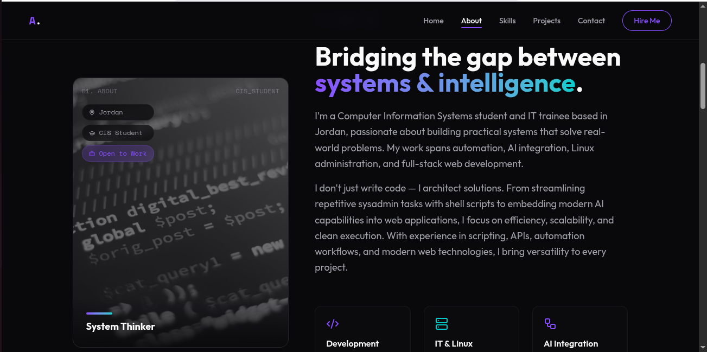
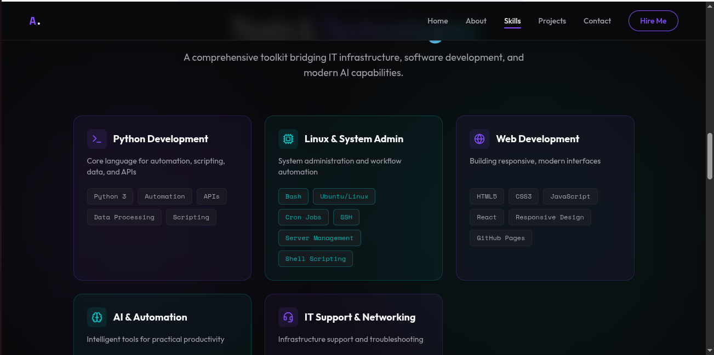
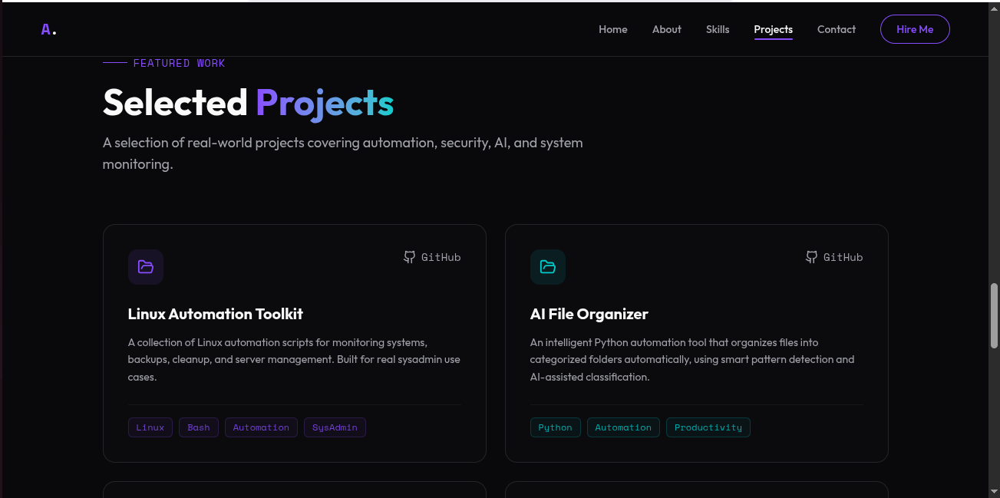
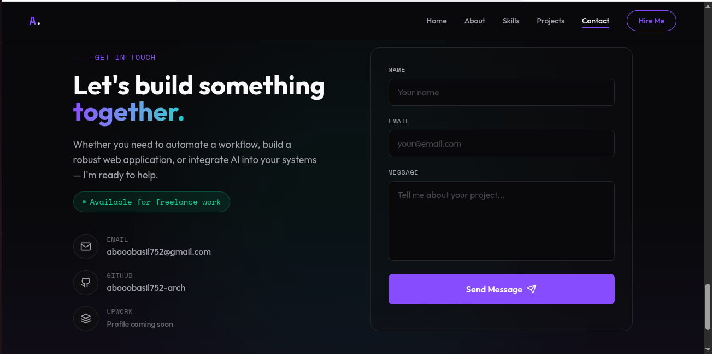

# AI Resume Analyzer 🚀

Modern AI-powered resume analyzer built with FastAPI, Next.js, and Groq AI.

## Features

- Upload PDF resumes
- AI-powered ATS analysis
- ATS score generation
- Resume strengths analysis
- Weakness detection
- Professional improvement suggestions
- Modern responsive UI

---

# Tech Stack

## Frontend
- Next.js
- TypeScript
- Tailwind CSS
- Framer Motion

## Backend
- FastAPI
- Python
- pdfplumber
- Groq API

---

# AI Model

This project uses:

- llama-3.1-8b-instant via Groq API

---

# Screenshots

## Home Page


## About Section


## Skills Section


## Projects Section


## Contact Section


---

# Installation

## Clone the repository

```bash
git clone https://github.com/abooobasil752-arch/Abdulrahman-Portfolio.git
```

---

# Frontend Setup

```bash
npm install

npm run dev
```

Frontend runs on:

```bash
http://localhost:3000
```

---

# Project Structure

```bash
src/
├── components/
├── sections/
├── assets/
├── styles/
├── hooks/
```

---

# About Me

Hi, I'm Abdulrahman — a Computer Information Systems student and aspiring AI & Full-Stack Developer from Jordan.

I enjoy building practical systems that combine modern web technologies, automation, Linux administration, and AI integration.

My focus is creating clean, scalable, and real-world solutions that improve productivity and user experience.

This project was fully designed and developed by me as part of my learning journey in modern web development and AI-powered applications.

---

# Connect With Me

- GitHub: https://github.com/abooobasil752-arch
- Email: abooobasil752@gmail.com

---

# Author

Developed with 💜 by Abdulrahman
